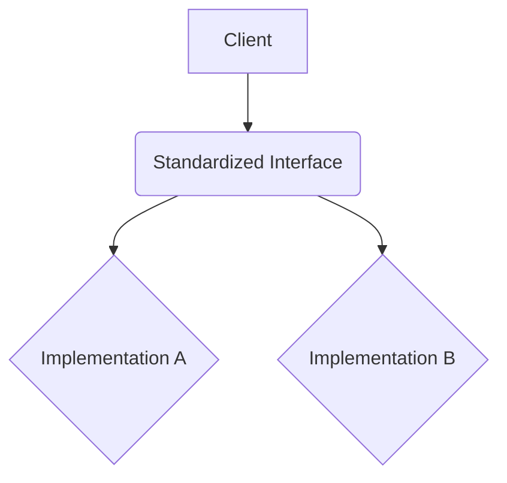

# TSIP-XXXX: [Proposal Title]

- **Status**: `draft` | `preview` | `stable`
    - `draft`: Initial idea, under discussion.
    - `preview`: Feature-complete, seeking feedback and early adoption.
    - `stable`: Сonsidered finalized. At least one implementation available.
- **Authors**:
    - [Author Name 1](link to profile)
    - [Author Name 2](link to profile)
- **Created**: YYYY-MM-DD
- **Updated**: YYYY-MM-DD

## Abstract

(A brief, one-to-two paragraph summary of the proposal. What is it and why is it important?)

## Motivation

(Describe the problem this proposal aims to solve. Why is this interface needed? What pain points does it address for developers? You can reference the "The Problem We Solve" section from the main `README.md`.)

## Design Goals

### Goals

- (What are the primary objectives of this interface?)
- (e.g., Improve interoperability between X and Y.)
- (e.g., Simplify common task Z.)

### Non-Goals

- (What is explicitly out of scope for this interface?)
- (e.g., This interface does not attempt to solve problem A.)
- (e.g., Performance optimization beyond reasonable defaults is not a primary goal.)

## Guidance

(A detailed description of the proposed interface(s) and its components. Explain how it works, the concepts involved, and the expected behavior. Use diagrams if they help clarify complex interactions.)



## TypeScript Definitions

(Provide the complete TypeScript code for the interface(s) being proposed. Ensure it's well-documented.)

```typescript
// Example:
export interface MyNewInterface {
    /**
     * A brief description of this property.
     */
    property: string;

    /**
     * A brief description of this method.
     * @param param A description of the parameter.
     * @returns A description of the return value.
     */
    method: (param: number) => boolean;
}
```

## Rationale

(Explain the key design decisions made in this proposal. Why were certain choices made over alternatives? What trade-offs were considered? This section helps others understand the thinking behind the proposal.)

- **Decision 1**: [Description of decision]
    - **Reason**: [Why this was chosen]
    - **Alternatives Considered**: [Alternative A, Alternative B]
- **Decision 2**: ...

## Dependency Injection Tokens (if applicable)

(If the proposal involves or recommends specific Dependency Injection (DI) tokens for discoverability or extensibility, describe them here. Explain their purpose and how they should be used.)

```typescript
// Example:
// export const MY_SERVICE_TOKEN = new InjectionToken<MyNewInterface>('MyServiceToken');
```

## Adoption Guide

### Implementing the Interface

(Provide specific guidance for library authors who want to implement this interface. What are the key considerations? Are there any best practices they should follow?)

```typescript
// How a library or class would implement this interface
class MyImplementation implements MyNewInterface {
    property: string = 'example';

    method(param: number): boolean {
        return param > 0;
    }
}
```

### Consuming the Interface

```typescript
// How a user or another part of an application would use an instance of this interface
function processData(service: MyNewInterface) {
    console.log(service.property);
    if (service.method(10)) {
        // ...
    }
}
```

## FAQ (Frequently Asked Questions)

(Address potential questions that might arise regarding the proposal, its implementation, or its use cases. This can be populated from discussions during the review process.)

- **Q: [Question 1]?**
    - A: [Answer 1]
- **Q: [Question 2]?**
    - A: [Answer 2]

## Unresolved Questions / Future Considerations

(List any open questions, areas for future improvement, or related features that are not covered by the current proposal but might be addressed later.)

- [Question/Consideration 1]

## Prior Art / References

(List any existing libraries, specifications, articles, or discussions that inspired or are related to this proposal.)

- [Link to related work 1]
- [RFC or Standard X]

## Compatible Implementations / Projects Using This Interface

(A list of known libraries, frameworks, or projects that have adopted, are compatible with, or are using this interface proposal. This helps users find real-world examples and encourages adoption.)

- [Library 1](link) - (Brief description of how it implements the proposal)
- [Library 2](link)

## Projects Using This Interface

(A list of known libraries, frameworks, or projects that have adopted, are compatible with, or are using this interface proposal. This helps users find real-world examples and encourages adoption.)

- [Project 1](link) - (Brief description of how it uses the interface)
- [Project 2](link)

## Changelog

All notable changes to this proposal will be documented in this section.

### YYYY-MM-DD

- [Description of change made]
