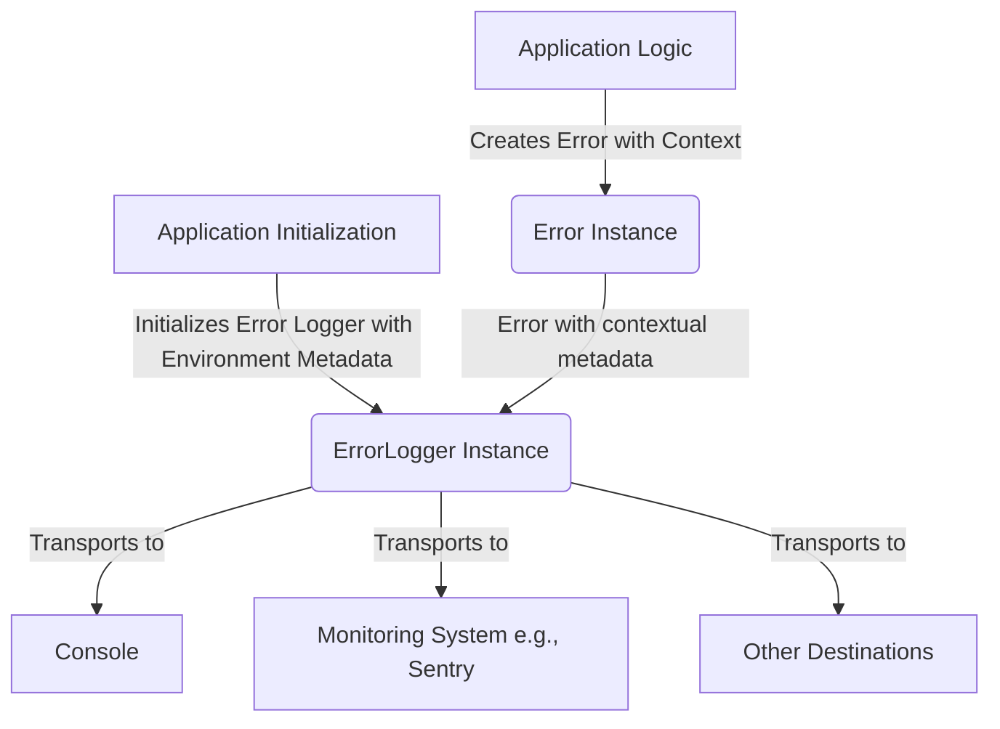

# TSIP-02: ErrorLogger Interface Proposal

- **Status**: `preview`
- **Authors**:
    - [Maksim Zemskov](https://github.com/nodge)

## Abstract

This proposal introduces an `ErrorLogger` interface for TypeScript/JavaScript applications. It defines a standard contract for logging error instances, aiming to improve consistency in how errors are reported to various destinations such as the console, monitoring systems, or tracing services.

## Motivation

Currently, error logging in TypeScript/JavaScript projects often lacks standardization. Different libraries and application components might use `console.log`, `console.error`, or custom logging solutions with varying signatures and capabilities. This inconsistency makes it difficult to:

- Reliably capture structured error information.
- Integrate with centralized logging and monitoring systems effectively.
- Ensure that critical diagnostic information, like stack traces, is always present.
- Distinguish between different error severities in a consistent manner.

A standardized `ErrorLogger` interface addresses these issues by providing a clear contract for how errors should be logged, promoting better error management practices across diverse codebases.

## Design Goals

### Goals

- Provide a simple, well-defined interface for logging errors.
- Ensure that all logged errors include stack trace information.
- Standardize error logging method names based on severity.
- Facilitate easier integration with various logging backends (console, monitoring services, etc.).
- Decouple error creation and contextualization (handled by `BaseError` or similar) from error reporting.

### Non-Goals

- Define the specific implementation of the logger (e.g., how it transports logs). This is left to the implementers.
- Handle general-purpose logging (e.g., debug messages, trace logs, application events). The interface is specifically for errors.
- Dictate the format of the logged output. The logger implementation decides this.
- Provide mechanisms for log filtering or routing; these are concerns of the logging implementation.

## TypeScript Definitions

```typescript
/**
 * A standard interface for logging error instances.
 */
export interface ErrorLogger {
    /**
     * Logs an informational error.
     * These are typically errors that do not disrupt the application's normal flow but are worth noting.
     * @typeParam T The type of the error
     * @param error The error instance to log.
     */
    info<T>(error: [unknown] extends [T] ? T : Error): void;

    /**
     * Logs a warning error.
     * These indicate potential problems or unexpected situations that are not critical
     * but might lead to issues if not addressed.
     * @typeParam T The type of the error
     * @param error The error instance to log.
     */
    warn<T>(error: [unknown] extends [T] ? T : Error): void;

    /**
     * Logs a general error.
     * These are typically runtime errors that disrupt a specific operation
     * but may not halt the entire application.
     * @typeParam T The type of the error
     * @param error The error instance to log.
     */
    error<T>(error: [unknown] extends [T] ? T : Error): void;

    /**
     * Logs a fatal error.
     * These are critical errors that usually precede an application shutdown or an unrecoverable state.
     * It is intended to be logged just before the process exits or browser tab shows error screen.
     * @typeParam T The type of the error
     * @param error The error instance to log.
     */
    fatal<T>(error: [unknown] extends [T] ? T : Error): void;
}
```

## Behavioral Requirements

1. **Method Signatures**: Each logging method (info, warn, error, fatal) MUST be generic with a type parameter `T` and accept exactly one parameter with the conditional type `[unknown] extends [T] ? T : Error`, returning `void`.

2. **Type Parameter Behavior**:
    - When called without an explicit type parameter (e.g., `errorLogger.error(err)`), the type defaults to `Error`, requiring callers to pass an `Error` instance.
    - When called with an explicit `unknown` type parameter (e.g., `errorLogger.error<unknown>(err)`), the method accepts any value type.

3. **Synchronous Execution**: All logging methods MUST be synchronous. They MUST NOT return a `Promise`. While the underlying logging mechanism (e.g., sending data to a remote service) might be asynchronous, the interface itself does not return a `Promise`. Any asynchronous operations MUST be handled internally by the implementation without blocking the caller.

4. **Error Handling**: Implementations SHOULD handle failures gracefully and MUST NOT throw errors during logging operations. If logging fails, the implementation MAY log to a fallback mechanism (e.g., console) but MUST NOT interrupt the application flow.

5. **Type Handling**: When receiving values via the `<unknown>` type parameter, implementations MUST handle any value type. While `Error` instances are the expected input, implementations MUST handle other types (strings, objects, primitives) in a reasonable manner, making a best-effort attempt to extract meaningful information.

## Rationale

### Exclusion of `debug()`, `log()`, and `trace()` Methods

The `ErrorLogger` interface intentionally excludes `debug()`, `log()`, `trace()`, and similar methods commonly found in general-purpose logging frameworks. These methods are semantically unrelated to error logging:

- `debug()`, `log()`, and `trace()` are typically used for tracing application flow, outputting variable values, or recording general application events. They don't represent error severity levels.
- Including such methods would conflate error reporting with general application logging, diluting the focused purpose of the `ErrorLogger` interface.
- Error monitoring systems (like Sentry, Rollbar, etc.) are specifically designed to capture and analyze errors, not general debug logs. Mixing these concerns would complicate integration with such systems.

If you need general-purpose logging, use a separate logging interface or library designed for that purpose. The `ErrorLogger` maintains a clear, singular responsibility: reporting errors at appropriate severity levels.

### Parameter Type: Generic with Conditional Default

The `ErrorLogger` interface uses a generic type parameter with a conditional type `[unknown] extends [T] ? T : Error` for all logging methods. This design balances type safety with practical flexibility.

```typescript
error<T>(error: [unknown] extends [T] ? T : Error): void;
```

This conditional type evaluates as follows:

- If `T` is not explicitly provided or is inferred from context, it defaults to requiring an `Error` instance
- If `T` is explicitly set or is inferred to `unknown`, it accepts any value type

This creates a "strict by default, flexible when needed" behavior:

1. **Strict by Default**: Without explicit type parameters, the interface requires `Error` instances, encouraging best practices and ensuring stack traces are available.

```typescript
// Requires Error instance by default
errorLogger.error(new Error("Failed"));

// Type error - string not assignable to Error
errorLogger.error("something went wrong");
```

2. **Flexibility When Needed**: In scenarios where the error type is unknown (like `catch` blocks), values can be passed directly without explicit type casts or type guards:

```typescript
try {
    // ... code ...
} catch (err: unknown) {
    // Allow unknown types when needed
    errorLogger.error(err);
}
```

#### Implementation Responsibility

Logger implementations must handle values on a best-effort basis, regardless of how they were passed:

- When receiving an `Error` instance (the default), extract its message, stack trace, and properties.
- When receiving a value via `<unknown>` type parameter, handle any type intelligently:
    - If it's an `Error` instance, treat it as above
    - If it's a string or object, or any other value, wrap or format appropriately
    - Always attempt to capture a stack trace when possible

This design provides the best of both worlds: strong typing that catches mistakes at compile time, with an escape hatch for the genuinely ambiguous cases in JavaScript error handling.

### Separation of Concerns (`ErrorLogger` vs. `BaseError`)

The design of `ErrorLogger` deliberately separates the responsibilities of error handling into distinct stages to promote clarity and maintainability. Error creation and the addition of specific contextual details are best handled within the application code, precisely where an error originates. This is where an error instance, such as one derived from `BaseError` (as proposed in [TSIP-01](./TSIP-01%20BaseError.md)), takes on the role of a data container, collecting and storing all relevant information pertinent to that specific error event.

Once an error object is populated, the `ErrorLogger` interface comes into play. Its sole responsibility is to act as a transporter, moving this error object from the application to various designated reporting destinations, which could include the console, a centralized monitoring system like Sentry, or a tracing service.

This separation ensures that the `ErrorLogger` itself does not need to understand the intricate details of every possible error type. While an `ErrorLogger` implementation can (and often should) enrich the error data with broader environment-specific or application-wide metadata (such as a `userId`, `requestId`, or session information), it remains agnostic to the intrinsic details of the error it is logging.

Flow:

1. Application code creates an error (ideally a `BaseError` subclass) and attaches contextual data.
2. The error is passed to an `ErrorLogger` implementation. Manually or via centralized error handler.
3. The logger processes and transmits the error (e.g., to Sentry, console).



### Synchronous Logging Methods

Although logging to external systems (like monitoring services) often involves I/O operations and is inherently asynchronous, the `ErrorLogger` methods are defined as synchronous (returning `void`). This is intentional to prevent logging operations from blocking or delaying the application's primary business logic. The logger implementation is responsible for managing any asynchronous operations internally (e.g., using a queue, fire-and-forget).

Returning `Promise<void>` would require `await` at every logging call site, potentially complicating application code and introducing performance overhead if not handled carefully.

## Adoption Guide

### Consuming the Interface in Libraries

Libraries can accept a `ErrorLogger` as a configuration option to allow consumers to provide their own logger implementation:

```typescript
import type { ErrorLogger } from "tsip";

interface LibraryConfig {
    errorLogger: ErrorLogger;
}

export function initLibrary(config: LibraryConfig) {
    const errorLogger = config.errorLogger;
    // Use errorLogger to log errors in the library
}
```

Libraries can also consume `ErrorLogger` via `tsip/runtime` dependency injection container:

```typescript
import { runtime, ErrorLoggerToken } from "tsip/runtime";

const errorLogger = runtime.get(ErrorLoggerToken);

async function fetchData(url: string) {
    try {
        const response = await fetch(url);
        return response.json();
    } catch (error) {
        errorLogger.error(error);
    }
}
```

### Consuming the Interface in Application Code

Applications can import a `ErrorLogger` implementation directly from a compatible library:

```typescript
import { errorLogger } from "some-compatible-library";

try {
    // ... application logic ...
} catch (err) {
    errorLogger.error(err);
}
```

Alternatively, applications can use the `tsip/runtime` dependency injection container:

```typescript
import { runtime, ErrorLoggerToken } from "tsip/runtime";

const errorLogger = runtime.get(ErrorLoggerToken);

try {
    // ... application logic ...
} catch (err) {
    errorLogger.error(err);
}
```

## FAQ (Frequently Asked Questions)

- **Q: Can I use this for general application logging (e.g., debug messages)?**
    - A: This interface is specifically designed for error logging. For general-purpose logging (debug, info events, traces), a different logging interface would be more appropriate.

- **Q: Why are the logging methods synchronous? Shouldn't I/O operations be asynchronous?**
    - A: The interface methods are synchronous to avoid complicating application logic with `async/await` for logging calls and to prevent logging from blocking critical paths. The _implementation_ of the `ErrorLogger` is responsible for handling any asynchronous I/O (e.g., sending logs over the network) in a non-blocking way, perhaps by using an internal queue or fire-and-forget strategy.

- **Q: How does this relate to `BaseError` (TSIP-01)?**
    - A: `BaseError` focuses on standardizing the structure of error objects themselves, allowing them to carry rich contextual information. `ErrorLogger` provides a standard way to _consume_ these (and other) `Error` objects for reporting purposes. They are complementary: `BaseError` helps create informative errors, and `ErrorLogger` helps report them consistently.

## Unresolved Questions / Future Considerations

- None

## Prior Art / References

- Common logging libraries in JavaScript/Node.js (e.g., Winston, Pino, Bunyan) often provide similar leveled logging but with more extensive configuration and features beyond just error reporting.
- Sentry SDK, LogRocket, and other monitoring tools provide client-side error capturing mechanisms.

## Compatible Implementations

Many existing logging libraries provide implementations that are compatible with the `ErrorLogger` interface out of the box or with minimal adapters. Compatibility typically requires aliasing method names or wrapping existing logger methods to match the interface signature.

The following libraries provide methods that directly match `ErrorLogger` interface:

- **[pino](https://www.npmjs.com/package/pino)**
- **[bunyan](https://www.npmjs.com/package/bunyan)**

The following libraries require minimal method aliasing to conform to the interface:

- **Browser/Node.js Console** - Native console object. Requires aliasing:
    - `fatal()` → `console.error()`
- **[@sentry/browser](https://www.npmjs.com/package/@sentry/browser) / [@sentry/node](https://www.npmjs.com/package/@sentry/node)** - Requires wrapping all methods:
    - `info()` → `Sentry.captureException(err, { level: 'info' })`
    - `warn()` → `Sentry.captureException(err, { level: 'warning' })`
    - `error()` → `Sentry.captureException(err, { level: 'error' })`
    - `fatal()` → `Sentry.captureException(err, { level: 'fatal' })`
- **[winston](https://www.npmjs.com/package/winston)** - Requires aliasing:
    - `fatal()` → `winston.crit()`
- **[NestJS Logger](https://docs.nestjs.com/techniques/logger#using-the-logger-for-application-logging)** - Requires aliasing:
    - `info()` → `logger.log()`

## Projects Using This Interface

- Information about usage is currently unknown.
