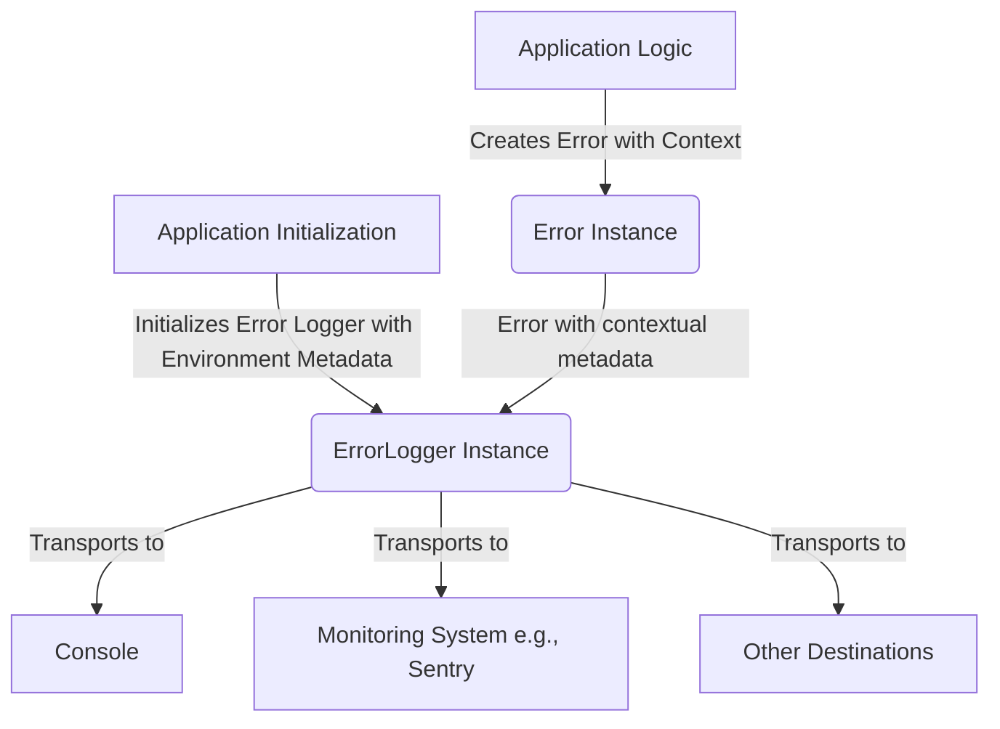

# TSIP-02: ErrorLogger Interface Proposal

- **Status**: `draft` (Initial idea, under discussion)
- **Authors**:
    - [Maksim Zemskov](https://github.com/nodge)
- **Created**: 2025-05-09
- **Updated**: 2025-05-09

## Abstract

This proposal introduces an `ErrorLogger` interface for TypeScript/JavaScript applications. It defines a standard contract for logging error instances, aiming to improve consistency in how errors are reported to various destinations such as the console, monitoring systems, or tracing services.

## Motivation

Currently, error logging in TypeScript/JavaScript projects often lacks standardization. Different libraries and application components might use `console.log`, `console.error`, or custom logging solutions with varying signatures and capabilities. This inconsistency makes it difficult to:

- Reliably capture structured error information.
- Integrate with centralized logging and monitoring systems effectively.
- Ensure that critical diagnostic information, like stack traces, is always present.
- Distinguish between different error severities in a consistent manner.

A standardized `ErrorLogger` interface addresses these issues by providing a clear contract for how errors should be logged, promoting better error management practices across diverse codebases.

## Design Goals

### Goals

- Provide a simple, well-defined interface for logging errors.
- Ensure that all logged errors include stack trace information.
- Standardize error logging method names based on severity.
- Facilitate easier integration with various logging backends (console, monitoring services, etc.).
- Decouple error creation and contextualization (handled by `BaseError` or similar) from error reporting.

### Non-Goals

- Define the specific implementation of the logger (e.g., how it transports logs). This is left to the implementers.
- Handle general-purpose logging (e.g., debug messages, trace logs, application events). The interface is specifically for errors.
- Dictate the format of the logged output. The logger implementation decides this.
- Provide mechanisms for log filtering or routing; these are concerns of the logging implementation.

## Guidance

The `ErrorLogger` interface defines a set of methods for logging errors at different severity levels. Each method accepts a single argument: an instance of the `Error` class (or its subclasses). This ensures that essential information like the error message and stack trace is consistently available for logging.

- `info(error: Error): void;`: Logs informational errors. These are typically errors that do not disrupt the application's normal flow but are worth noting.
- `warn(error: Error): void;`: Logs warning errors. These indicate potential problems or unexpected situations that are not critical but might lead to issues if not addressed.
- `error(error: Error): void;`: Logs general errors. These are typically runtime errors that disrupt a specific operation but may not halt the entire application.
- `fatal(error: Error): void;`: Logs fatal errors. These are critical errors that usually precede an application shutdown or an unrecoverable state.

The logging methods are synchronous (`void` return type). While the underlying logging mechanism (e.g., sending data to a remote service) might be asynchronous, the interface itself does not return a `Promise`.

## TypeScript Definitions

```typescript
/**
 * A standard interface for logging error instances.
 */
interface ErrorLogger {
    /**
     * Logs an informational error.
     * These are typically errors that do not disrupt the application's normal flow but are worth noting.
     * @param error The error instance to log.
     */
    info(error: Error): void;

    /**
     * Logs a warning error.
     * These indicate potential problems or unexpected situations that are not critical
     * but might lead to issues if not addressed.
     * @param error The error instance to log.
     */
    warn(error: Error): void;

    /**
     * Logs a general error.
     * These are typically runtime errors that disrupt a specific operation
     * but may not halt the entire application.
     * @param error The error instance to log.
     */
    error(error: Error): void;

    /**
     * Logs a fatal error.
     * These are critical errors that usually precede an application shutdown or an unrecoverable state.
     * It is intended to be logged just before the process exits or browser tab shows error screen.
     * @param error The error instance to log.
     */
    fatal(error: Error): void;
}
```

## Rationale

**Parameter Type (`Error` instance only)**

Accepting only `Error` instances ensures that a stack trace is available for every logged error. Stack traces are crucial for debugging and identifying the source of an error. Accepting `unknown[]` arguments (like `console.*` methods) would complicate standardized logging and make it harder to guarantee the presence of essential diagnostic information for monitoring systems.

Allowing `unknown` or `any` as input would shift the burden of ensuring an `Error` object and extracting a stack trace to the logger implementation, potentially leading to inconsistencies.

**Handling `unknown` errors at catch sites**

In `catch` blocks, the caught error is typed as `unknown`. It's not recommended to blindly cast this to `Error` because the actual thrown value might not be an `Error` instance. Instead, developers should either:

1. Wrap the caught value in a new `Error` (or `BaseError`) instance, passing the original as the `cause`.
2. Check the type using `instanceof Error` (or a similar reliable type guard) before logging, and create a new `Error` if necessary.

This promotes robust error handling and ensures the `ErrorLogger` always receives a valid `Error` object.

**Separation of Concerns (`ErrorLogger` vs. `BaseError`)**

The design of `ErrorLogger` deliberately separates the responsibilities of error handling into distinct stages to promote clarity and maintainability. Error creation and the addition of specific contextual details are best handled within the application code, precisely where an error originates. This is where an error instance, such as one derived from `BaseError` (as proposed in [TSIP-01](./TSIP-01%20BaseError.md)), takes on the role of a data container, collecting and storing all relevant information pertinent to that specific error event.

Once an error object is populated, the `ErrorLogger` interface comes into play. Its sole responsibility is to act as a transporter, moving this error object from the application to various designated reporting destinations, which could include the console, a centralized monitoring system like Sentry, or a tracing service. This separation ensures that the `ErrorLogger` itself does not need to understand the intricate details of every possible error type. While an `ErrorLogger` implementation can (and often should) enrich the error data with broader environment-specific or application-wide metadata (such as a `userId`, `requestId`, or session information), it remains agnostic to the intrinsic details of the error it is logging. This division keeps the logger's role focused and allows application code to manage error specifics, leading to a more modular and robust error management strategy.

Flow:

1. Application code creates an error (ideally a `BaseError` subclass) and attaches contextual data.
2. The error is passed to an `ErrorLogger` implementation. Manually or via centralized error handler.
3. The logger processes and transmits the error (e.g., to Sentry, console).
4. Additional metadata related to execution environment can be provided via `ErrorLogger` implementations.



**Exclusion of `debug`, `log`, `trace` methods**

The `ErrorLogger` interface is specifically focused on logging _errors_, particularly for integration with monitoring systems. Methods like `debug`, `log`, and `trace` typically have different semantics and are used for logging debugging information, application events, or other non-error data. Including them would dilute the purpose of `ErrorLogger`. A separate specific logger interface could be defined for those needs.

**Synchronous Logging Methods**

Although logging to external systems (like monitoring services) often involves I/O operations and is inherently asynchronous, the `ErrorLogger` methods are defined as synchronous (returning `void`). This is intentional to prevent logging operations from blocking or delaying the application's primary business logic. The logger implementation is responsible for managing any asynchronous operations internally (e.g., using a queue, fire-and-forget).

Returning `Promise<void>` would require `await` at every logging call site, potentially complicating application code and introducing performance overhead if not handled carefully.

## Adoption Guide

### Implementing the Interface

Library authors can implement the `ErrorLogger` interface as demonstrated in the example below. A library is free to introduce additional capabilities, provided they do not conflict with or alter the proposed behavior of `ErrorLogger`.

```typescript
const errorLogger: ErrorLogger = {
    info: err => console.info(err),
    warn: err => console.warn(err),
    error: err => console.error(err),
    fatal: err => console.error(err),
};
```

### Consuming the Interface

Applications can use an `ErrorLogger` instance (obtained via dependency injection or direct instantiation) to log errors.

```typescript
try {
    // ... application logic ...
} catch (err) {
    // Ensure 'err' is an Error instance before logging
    const normalizedError = err instanceof Error ? err : new Error('Unknown error', { cause: err });

    // Log error with ERROR severity
    errorLogger.error(normalizedError);
}
```

## FAQ (Frequently Asked Questions)

- **Q: Can I use this for general application logging (e.g., debug messages)?**

    - A: This interface is specifically designed for error logging. For general-purpose logging (debug, info events, traces), a different logging interface would be more appropriate.

- **Q: Why are the logging methods synchronous? Shouldn't I/O operations be asynchronous?**

    - A: The interface methods are synchronous to avoid complicating application logic with `async/await` for logging calls and to prevent logging from blocking critical paths. The _implementation_ of the `ErrorLogger` is responsible for handling any asynchronous I/O (e.g., sending logs over the network) in a non-blocking way, perhaps by using an internal queue or fire-and-forget strategy.

- **Q: How does this relate to `BaseError` (TSIP-01)?**

    - A: `BaseError` focuses on standardizing the structure of error objects themselves, allowing them to carry rich contextual information. `ErrorLogger` provides a standard way to _consume_ these (and other) `Error` objects for reporting purposes. They are complementary: `BaseError` helps create informative errors, and `ErrorLogger` helps report them consistently.

## Unresolved Questions / Future Considerations

- Should there be a way additional metadata alongside the error instance?

## Prior Art / References

- Common logging libraries in JavaScript/Node.js (e.g., Winston, Pino, Bunyan) often provide similar leveled logging but with more extensive configuration and features beyond just error reporting.
- Sentry SDK, LogRocket, and other monitoring tools provide client-side error capturing mechanisms.

## Compatible Implementations / Projects Using This Interface

- TODO: evaluate the existing libraries

## Projects Using This Interface

- None

## Changelog

### 2025-05-09

- Initial draft
